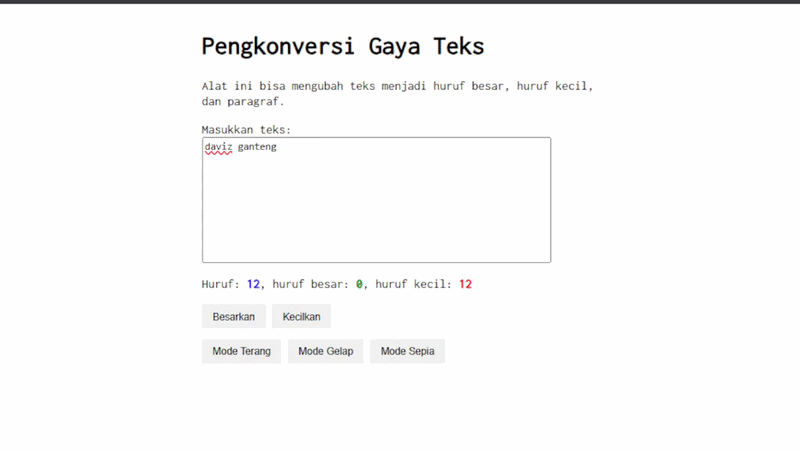

# Jurnal 04: 

  **Nama** : Davis Arvaputra Dwiansyah  
  **NIM** : 103122400034  
  **Kelas** : SE-08-01  
  

**Soal**

Tambahkan mode sepia dengan ketentuan:

Elemen         |	Warna
Latar belakang | #F4ECD8
Warna teks     |	#5B4636

Biarkan form tetap warna putih.

Ketentuan lainnya:

Bagian mode-div harus menaungi tiga button: light, dark, dan sepia
Bisa berpindah state secara mulus: sepia menghasilkan sepia-mode, dark menghasilkan dark-mode, dan light menghasilkan light-mode

**Kode sumber**

Tersedia di [index.html](./index.html) [index.js](./index.js) [style.css](./style.css)

**Output**

**Deskripsi Program**

Program ini menciptakan sebuah tampilan laman untuk Pengonversi Gaya Teks, dengan menggunakan HTML, CSS, dan JavaScript. Terdapat tiga mode tampilan yang dapat dipilih, yaitu **light mode**, **dark mode**, dan **sepia mode**, yang dikelompokkan dalam satu `mode-div` berisi tiga button. Untuk bagian sepia mode, ditambahkan class `.sepia-mode` pada CSS dengan warna latar belakang `#F4ECD8` dan warna teks `#5B4636`, sementara form textarea tetap berwarna putih. Pada JavaScript, setiap button mode akan menghapus class mode lainnya terlebih dahulu sebelum menerapkan mode yang dipilih, sehingga perpindahan antar state berjalan secara mulus

