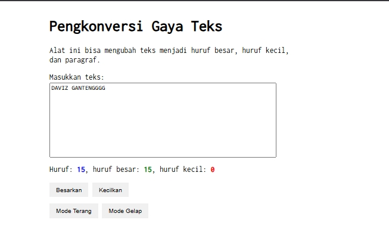

# Tugas Pendahuluan 04: 

  **Nama** : Davis Arvaputra Dwiansyah  
  **NIM** : 103122400034  
  **Kelas** : SE-08-01  
  

**Soal**

Penambahan dark mode & light mode dalam konversi text

**Kode sumber**

Tersedia di [index.html](./index.html) [index.js](./index.js) [style.css](./style.css)

**Output**

**Deskripsi Program**

Program ini menciptakan sebuah tampilan laman untuk Pengonversi Gaya Text, dengan menggunakan html, css dan javascript. Kemudian untuk bagian darkmodenya ditambahkan beberapa command css, dan juga javascriptnya

