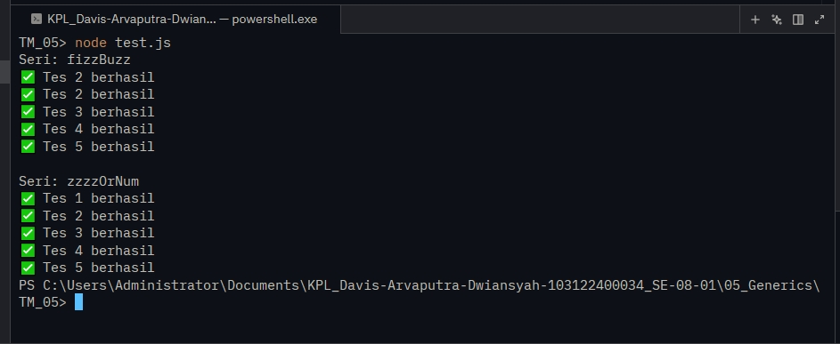

# Tugas Mandiri 05: 

  **Nama** : Davis Arvaputra Dwiansyah  
  **NIM** : 103122400034  
  **Kelas** : SE-08-01  
  

**Soal**

soal.jpg

**Kode sumber**

Tersedia di [index.js](./index.js)[test.js](./test.js)[fizz.js](./fizz.js)

**Output**

**Deskripsi Program**

Program ini dibuat menggunakan JavaScript untuk mengimplementasikan logika FizzBuzz pada bilangan bulat. Program ini terdiri dari dua fungsi utama, yaitu fungsi untuk mengolah satu nilai menjadi "Fizz", "Buzz", atau "FizzBuzz" sesuai aturan tertentu, serta fungsi untuk memproses sebuah array bilangan dan mengembalikan array baru dengan hasil transformasi tersebut. Program ini juga dilengkapi dengan validasi input untuk memastikan bahwa data yang diproses berupa bilangan bulat atau array bilangan bulat sesuai dengan yang diharapkan.

