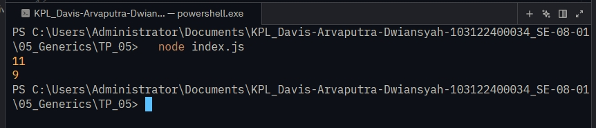

# Tugas Pendahuluan 05: 

  **Nama** : Davis Arvaputra Dwiansyah  
  **NIM** : 103122400034  
  **Kelas** : SE-08-01  
  

**Soal**

soal.jpg

**Kode sumber**

Tersedia di [index.js](./index.js)

**Output**

**Deskripsi Program**

Program ini dibuat menggunakan JavaScript untuk menghitung jumlah karakter dalam sebuah string. Program ini memiliki dua mode perhitungan, yaitu menghitung semua karakter termasuk spasi, dan menghitung hanya huruf tanpa spasi, menggunakan satu fungsi yang bersifat generic.

