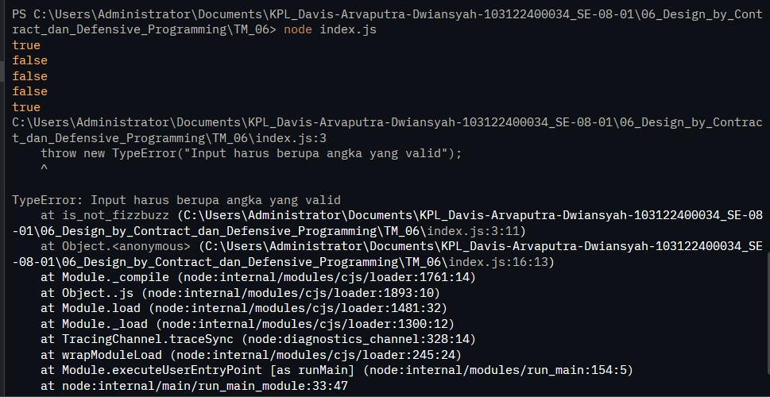

# Tugas Mandiri 06: Design_By_Contract

  **Nama** : Davis Arvaputra Dwiansyah  
  **NIM** : 103122400034  
  **Kelas** : SE-08-01  

## Tugas

Tugasmu adalah membuat fungsi yang menolak bilangan-bilangan kelipatan 3, 5, atau 15, menerima bilangan-bilangan bukan "fizz buzz", dan melempar yang bukan bilangan bulat.

## Program/Kode

Tersedia di [index.js](./index.js)

## Output

## Deskripsi

membuat dua percabangan if di dalam is_not_fizzbuzz dengan kondisi jika input bukan berupa number, lalu NaN, dan tak terhingga akan melempar typeError. Kemudian, jika input adalah number yg dimodulo 3 atau 5 = 0, maka akan return false.
