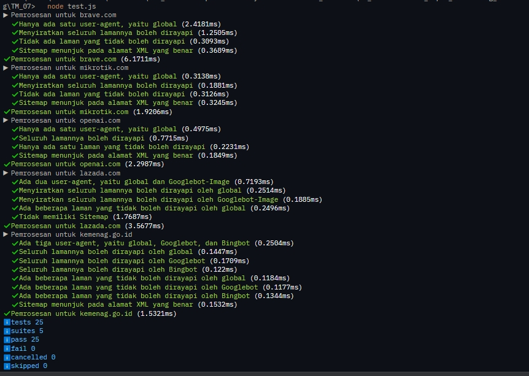

# Tugas Mandiri 07 :  	07_Grammar-Based_Input_Processing_Parsing  

  **Nama** : Davis Arvaputra Dwiansyah  
  **NIM** : 103122400034  
  **Kelas** : SE-08-01  

## Tugas

Uraikan robot!

Tugas pada kesempatan kali ini adalah membuat fungsi yang menguraikan isi robots.txt menjadi POJO (plain old JavaScript object). Empat properti yang perlu diuraikan dijabarkan di bawah berikut.

User-agent adalah nama robot perayapnya
Allow adalah daftar halaman-halaman yang boleh dirayap
Disallow adalah daftar halaman-halaman yang tidak boleh dirayap
Sitemap adalah sebuah pranala yang menunjuk pada "denah" situs web (biasanya berformat XML)
Kamu akan mengerjakannya di dalam sebuah fungsi bernama parseRobots di index.js dan. Buka direktori 07 di sini untuk mengunduh berkas yang dimaksud, berkas-berikas robots.txt di dalam direktori daftar, dan berkas pengujiannya yaitu test.js.

## Program/Kode

Tersedia di [index.js](./index.js).
Tersedia di [test.js](./test.js).

## Output

## Deskripsi

Pada Program Tugas Mandiri 07 ini ialah menguraikan isi file di robots.txt menjadi sebuah objek JavaScript (POJO). Fungsi parseRobots akan membaca teks baris per baris, kemudian mengelompokkan informasi berdasarkan User-agent, serta mencatat daftar halaman yang diizinkan (Allow) dan tidak diizinkan (Disallow) untuk diakses dan dibaca oleh robot mesin pencari. Selain itu, fungsi juga mengambil data Sitemap yang berisi tautan ke struktur situs. Hasil akhirnya disusun dalam bentuk objek dengan properti agents dan Sitemap agar mudah digunakan dalam proses selanjutnya.
