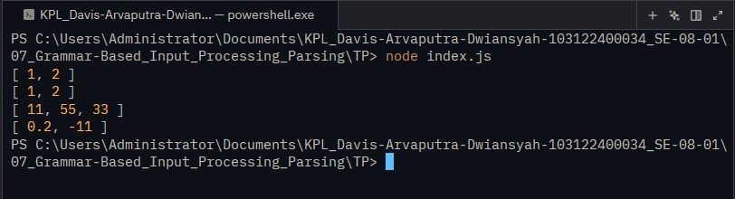

# Tugas Mandiri 07: Grammar-Based_Input_Processing_parsing

  **Nama** : Davis Arvaputra Dwiansyah  
  **NIM** : 103122400034  
  **Kelas** : SE-08-01  

## Tugas

Buatlah fungsi yang mengubah deretan angka bertipe string menjadi larik angka.

## Program/Kode

Tersedia di [index.js](./index.js)

## Output

## Deskripsi

Menambahkan fungsi toNumberArray untuk mengonversi input berupa teks terpisah koma maupun string menjadi kumpulan angka valid dengan menerapkan proses parsing.Fungsi ini melakukan validasi tipe input di awal, memecah string jika diperlukan, kemudian membersihkan spasi kosong menggunakan trim() dan mengubah setiap elemen menjadi angka melalui fungsi Number(). Lalu, menerapkan filter untuk membuang nilai NaN.
