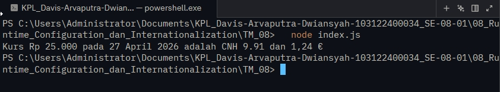

# Tugas Mandiri 08 :  	08_RUNTIME_CONFIGURATION_DAN_INTERNATIONALIZATION 

  **Nama** : Davis Arvaputra Dwiansyah  
  **NIM** : 103122400034  
  **Kelas** : SE-08-01  

## Tugas

Pada tugas ini kamu akan membuat program yang menampilkan kurs rupiah (IDR) terhadap renminbi luar Tiongkok (CNH) dan euro (EUR). Gunakan link API ini untuk mengambil data.

## Program/Kode

Tersedia di [index.js](./index.js).

## Output

## Deskripsi

Pada tugas kali ini, membuat sebuah program menggunakan Node.js yang mengambil data kurs mata uang dan melakukan konversi dari Rupiah (IDR) ke mata uang asing seperti CNH dan EUR. URL API disimpan dalam file .env sebagai bagian dari konfigurasi runtime. Data yang diperoleh kemudian diolah dan ditampilkan dengan format yang rapi menggunakan fitur Internationalization (Intl) untuk menyesuaikan format angka dan tanggal sesuai standar lokal. Program ini juga menerapkan pengelolaan konfigurasi yang baik serta menghasilkan output yang informatif dan mudah dibaca.
