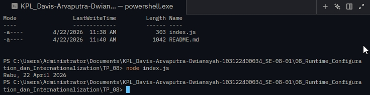

# Tugas pendahuluan 08 :  	08_RUNTIME_CONFIGURATION_DAN_INTERNATIONALIZATION 

  **Nama** : Davis Arvaputra Dwiansyah  
  **NIM** : 103122400034  
  **Kelas** : SE-08-01  

## Tugas

Tampilkan tanggal sekarang dengan format seperti ini:

```
Rabu, 22 April 2026
```

Nilai waktu tidak harus sama, asalkan formatnya benar dan bisa tampil di komputer terpisah pada waktu tertentu. Gunakan Intl.DateTimeFormat (bukan string manual).

## Program/Kode

Tersedia di [index.js](./index.js).

## Output



## Deskripsi

Kode tersebut mengambil tanggal saat ini (new Date()) => (`const now = new Date();`) , lalu memformatnya ke bahasa Indonesia menggunakan Intl.DateTimeFormat
```js
const formatter = new Intl.DateTimeFormat('id-ID', {
  weekday: 'long',
  day: 'numeric',
  month: 'long',
  year: 'numeric'
});
```
 dengan format hari, tanggal, bulan, dan tahun lengkap.

Hasilnya otomatis menyesuaikan waktu di komputer pengguna dan ditampilkan dalam bentuk seperti:
Rabu, 22 April 2026.
