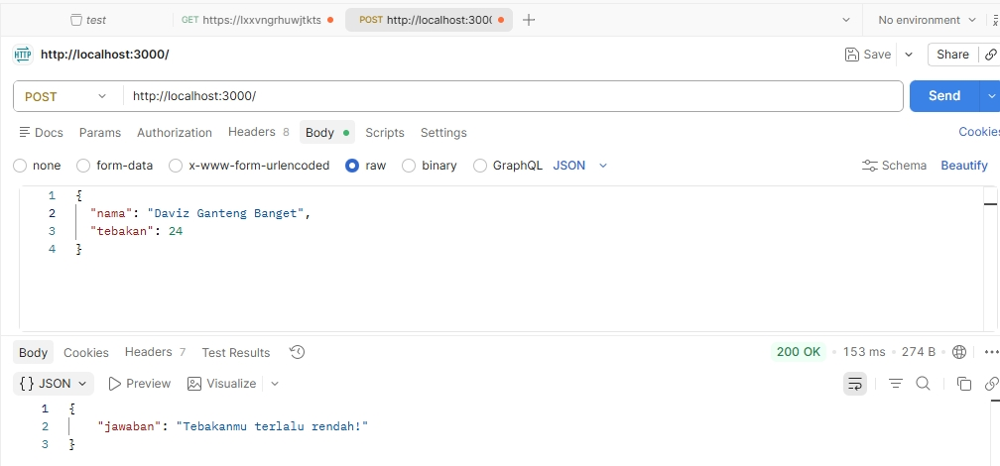

# Tugas Mandiri 09 :  	09 API Design dan Construction Using Swagger 

  **Nama** : Davis Arvaputra Dwiansyah  
  **NIM** : 103122400034  
  **Kelas** : SE-08-01  

  
## Tugas

Membuat sebuah API sederhana dengan satu endpoint yaitu POST / untuk permainan tebak angka, dimana user mengirimkan nama dan angka tebakan, kemudian API akan memberikan respon apakah tebakan tersebut benar, terlalu tinggi, atau terlalu rendah berdasarkan angka rahasia yang bersifat tetap untuk setiap nama.

## Program/Kode

Tersedia di [index.js](./index.js).

## Output

## Deskripsi

Pada tugas mandiri 09 kali ini, membuat sebuah API sederhana menggunakan Express.js yang menyediakan satu endpoint POST untuk permainan tebak angka. User mengirimkan data berupa nama dan angka tebakan dalam format JSON, kemudian sistem akan menghasilkan angka rahasia berdasarkan nama menggunakan metode hashing (MD5) sehingga nilai yang dihasilkan bersifat tetap (deterministic) tanpa perlu penyimpanan database. Selanjutnya, API akan membandingkan angka tebakan dengan angka rahasia dan mengembalikan respon berupa apakah tebakan benar, terlalu tinggi, atau terlalu rendah. API ini dapat diuji menggunakan Postman.
