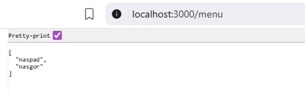
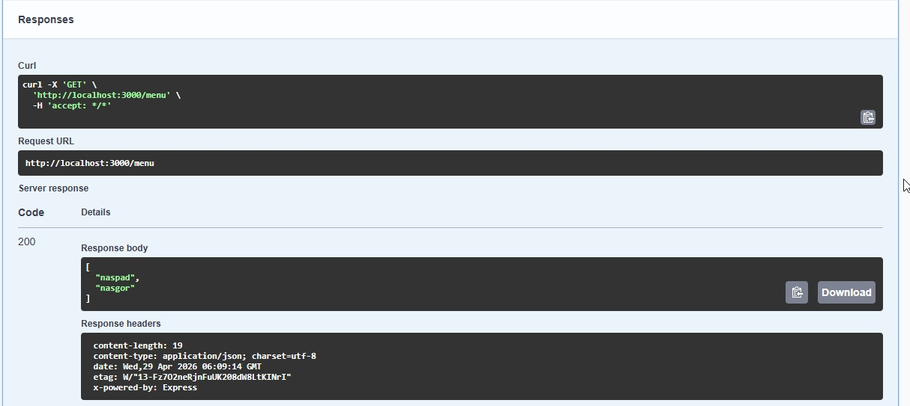
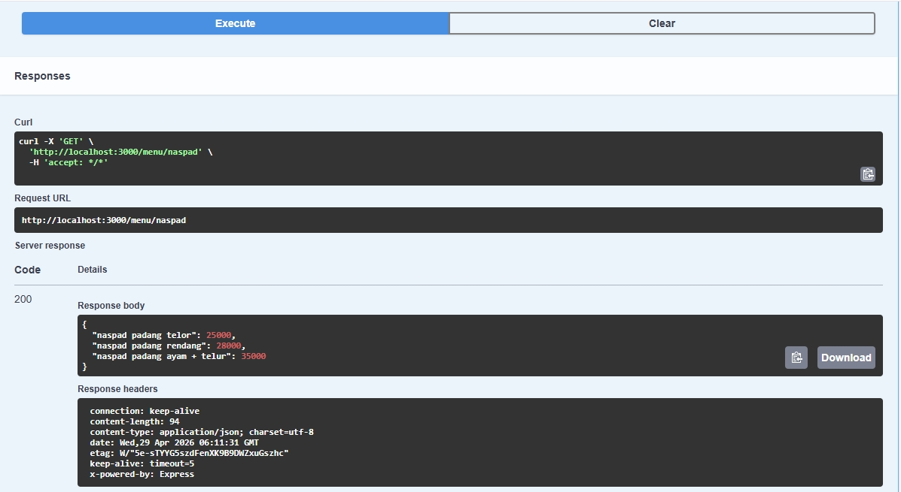

# Tugas pendahuluan 09 :  	09 API Design dan Construction Using Swagger 

  **Nama** : Davis Arvaputra Dwiansyah  
  **NIM** : 103122400034  
  **Kelas** : SE-08-01  

## Tugas

Buatlah satu endpoint lagi beserta dokumentasi OpenAPI-nya, yaitu GET /menu yang menampilkan daftar semua nama kategori menu yang ada.

## Program/Kode

Tersedia di [index.js](./index.js).
Tersedia di [swagger.js](./swagger.js).

## Output

## Deskripsi

Pada tugas pendahuluan 09 kali ini, membuat sebuah API sederhana menggunakan Express.js yang menyediakan endpoint untuk menampilkan data menu makanan berdasarkan kategori serta daftar seluruh kategori yang tersedia dengan menggunakan http method Get. Selain itu, API didokumentasikan secara otomatis menggunakan OpenAPI Swagger sehingga memudahkan pengguna dalam memahami dan menguji endpoint yang tersedia melalui halaman /docs.
