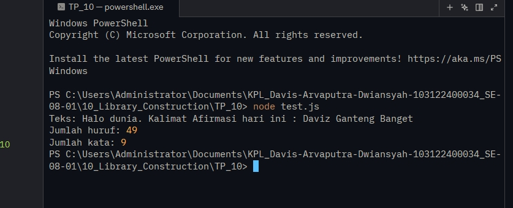

# Tugas pendahuluan 10 :  Library Construction

  **Nama** : Davis Arvaputra Dwiansyah  
  **NIM** : 103122400034  
  **Kelas** : SE-08-01  

## Tugas

Buatlah pustaka JavaScript yang menyediakan utilitas berupa dua fungsi:

Menghitung jumlah huruf dalam sebuah teks
Menghitung jumlah kata dalam sebuah teks

Dengan kriteria:

- Hanya alfabet A hingga Z yang dihitung (huruf besar dan kecil) Spasi tidak dihitung
- Pustaka dapat di-import ke file lain

## Program/Kode

Tersedia di [index.js](./index.js).
Tersedia di [test.js](./test.js).

## Output

## Deskripsi

Pada tugas pendahuluan 10 kali ini, dibuat sebuah pustaka (library) JavaScript sederhana yang berisi dua fungsi utama, yaitu hitungHuruf dan hitungKata.

Fungsi hitungHuruf digunakan untuk menghitung jumlah huruf dalam sebuah teks dengan hanya memperhitungkan karakter alfabet (A-Z dan a-z), sehingga angka, simbol, dan spasi tidak ikut dihitung.

Sedangkan fungsi hitungKata digunakan untuk menghitung jumlah kata dalam teks dengan memisahkan kata berdasarkan spasi, serta hanya menghitung kata yang terdiri dari huruf.

Pustaka ini dibuat menggunakan sistem module ES (ESM) sehingga dapat di-import ke dalam file JavaScript lain menggunakan sintaks import. Selain itu, pengujian dilakukan melalui file test.js untuk memastikan kedua fungsi berjalan sesuai dengan kriteria yang diberikan.
