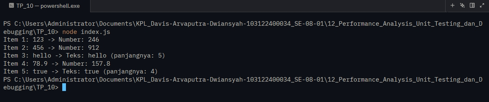

# Tugas Pendahuluan 12 : Performance Analysis, Unit Testing, dan Debugging

  **Nama** : Davis Arvaputra Dwiansyah  
  **NIM** : 103122400034  
  **Kelas** : SE-08-01  

## Tugas

Cobalah untuk menangkap kecacatan dalam kode ini

```
function main() {
  const data = [
    "123",
    456,
    "hello",
    78.9,
    true,
  ];

  for (let i = 0; i < data.length; i++) {
    const result = processData(data[i]);
    console.log(`Item ${i + 1}: ${data[i]} -> ${result}`);
  }
}

function processData(data) {
  const str = data.toLowerCase();
  const num = parseInt(str);
  if (!isNaN(num) && str === String(num)) {
    return `Number: ${num * 2}`;
  }
  return `Teks: ${str} (panjangnya: ${str.length})`;
}

main();
```

## Program/Kode

Tersedia di [index.js](./index.js)

## Output



## Deskripsi

Pada Tugas Pendahuluan 12, dibuat sebuah program JavaScript sederhana yang berfungsi untuk memproses berbagai jenis data dalam sebuah array menggunakan perulangan dan fungsi. Program membaca setiap elemen data, kemudian mengubahnya menjadi string dan memeriksa apakah data tersebut berupa angka atau teks. Jika data merupakan angka, program akan mengalikan nilainya dengan dua dan menampilkan hasilnya, sedangkan jika data berupa teks, program akan menampilkan isi teks beserta jumlah karakternya. Hasil pemrosesan setiap data ditampilkan menggunakan console.log(), sehingga program ini menerapkan konsep dasar JavaScript seperti array, percabangan, fungsi, perulangan, serta konversi tipe data.
